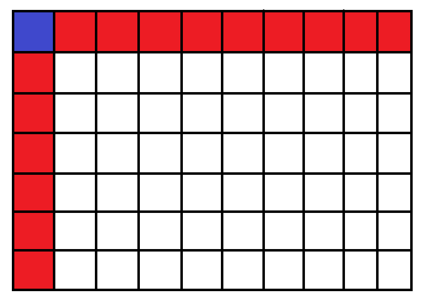
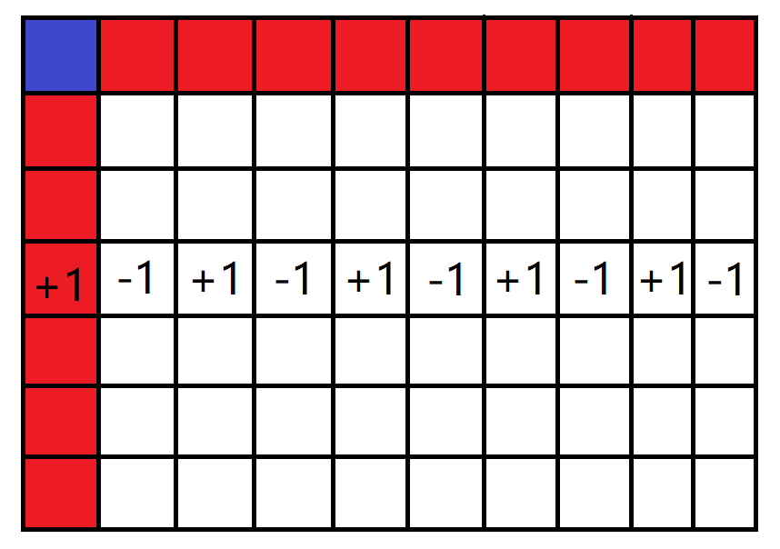
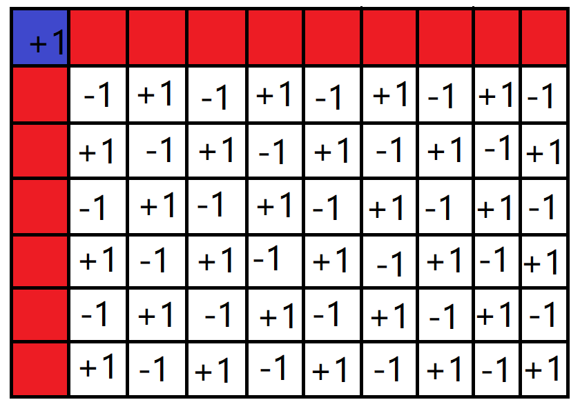

# [省选联考 A卷 Day1T2] 矩阵游戏 题解

### 题意

给定一个$(n-1)\times(m-1)$的矩阵$b_{i,j}$，要求构造出一个$n\times m$的矩阵$a_{i,j}$满足$\forall i,j\quad b_{i,j}=a_{i,j}+a_{i-1,j}+a_{i,j-1}+a_{i-1,j-1}$且$\forall i,j\quad a_{i,j}\in [0,10^6]$

### 题解

首先，我们先不管第二个条件

发现可以任意指定矩阵$a$的第一行和第一列（图中红色和蓝色部分），且每次指定都对应着唯一的构造方案

我们先把红蓝部分全置为0，递推一遍剩下白色部分的元素，设此时填出的矩阵为$c_{i,j}$

观察红色格子的加1对白色格子的影响：

当前行或列的所有下标为奇数的格子加1，下标为偶数的格子减1

蓝色格子加1对白色格子的影响：

对所有的白色格子，若行列下标之和为奇数则加1，否则减1

尝试写出第二个限制

$\forall i,j\quad c_{i,j}\pm a_{1,j}\pm a_{i,1}\pm a_{1,1}\in [0,10^6]$

令$w_{0,i}=\begin{cases}-a_{i,1} &i\equiv0(\operatorname{mod}2)\\a_{i,1}&i\equiv1(\operatorname{mod}2)\end{cases}$，$w_{1,i}=\begin{cases}a_{1,i}+a_{1,1} &i\equiv0(\operatorname{mod}2)\\-a_{1,i}+a_{1,1}&i\equiv1(\operatorname{mod}2)\end{cases}$

$\forall i,j\quad c_{i,j}\pm(w_{0,i}-w_{0,j})\in [0,10^6]$

然后做差分约束就行了