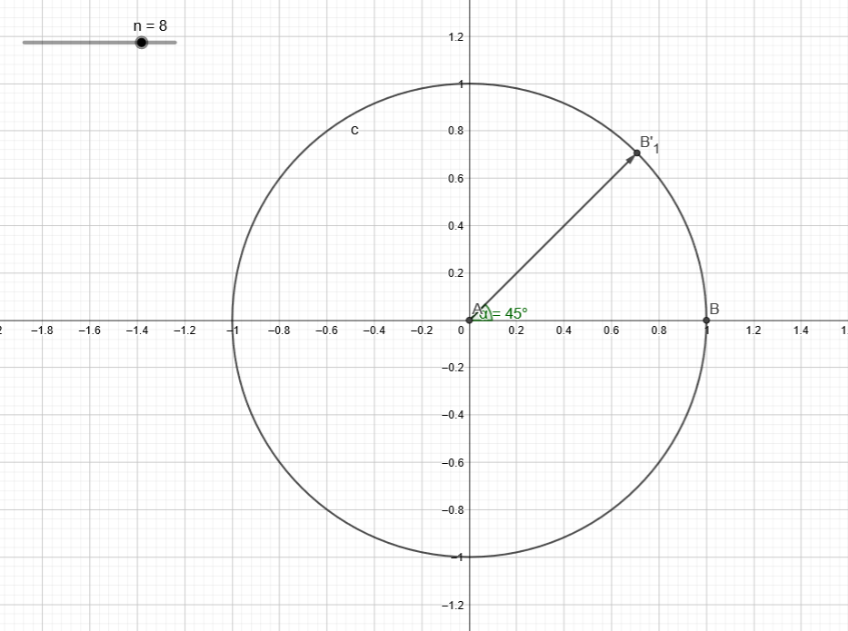

# 多项式

## 母函数

又称生成函数，一种形式幂级数，其每一项都代表序列中某一项的值，类似这样：
$$
F(x)=\sum_na_nk_n(x)
$$
其中$k_n(x)$称为核函数

1. $k_n(x)=x^n$:普通生成函数
2. $k_n(x)=\frac{x^n}{n!}$:指数生成函数

用$[k_n(x)]F(x)$表示母函数第$n$项的系数$a_n$

## 多项式乘法

**卷积**:形如$h_n=\sum_if_ig_{n-i}$的式子

可以通过构造母函数$F(x)=f_0+f_1x+f_2x^2+\cdots$，$G(x)=g_0+g_1x+g_2x^2+\cdots$，$H(x)=h_0+h_1x+h_2x^2+\cdots$

发现$H(x)=F(x)\cdot G(x)$，只要解决多项式乘法就能算出卷积

### 点值表示

对于一个$n-1$次多项式$f(x)=a_0+a_1x+a_2x^2+\cdots +a_{n-1}x^{n-1}$，其系数等价于函数在$n$个不同点的取值$\{x_0,x_1,\cdots,x_{n-1}\}$

多项式与$n$个点的取值一一对应，可以用系数求点值，用点值求系数

我们只需要将$f(x)$和$g(x)$转化为点值表示，再根据$H(x)=F(x)\cdot G(x)$求出$H(x)$的点值表示，最后转化成$H(x)$的系数表达式

### 快速傅里叶变换(FFT)

FFT包括两部分，DFT和IDFT，分别是将多项式从表达式转化为点值表示，将点值表示转化为表达式

#### 复数

定义复数单位$i$使得$i^2=-1$，称形如$z=a+bi,a\in R,b\in R$的数为**复数**

##### 复数运算

**加**:$(a+bi)+(c+di)=(a+c)+(b+d)i$

**减**:$(a+bi)-(c+di)=(a-c)+(b-d)i$

**乘**:$(a+bi)\cdot (c+di)=(ac-bd)+(ad+bc)i$

**除**:$\large{\frac{a+bi}{c+di}=\frac{(a+bi)(c-di)}{c^2+d^2}=\frac{(ac+bd)+(bc-ad)i}{c^2+d^2}}$

##### 复数单位根

定义$n$次单位根$\omega_n=e^{\frac{2\pi i}{n}}$，方程$x^n=1$的解集可以表示为$\{\omega_n^k|k=0,1,2,\cdots ,n-1\}$，其在复平面对应向量的方向为单位圆$n$等分的第一个角

$\omega_n=e^{\frac{2\pi i}{n}}=\cos(\frac{2\pi}{n})+i\cdot\sin(\frac{2\pi}{n})$



图中向量为$\omega_8$

###### 性质

$$
\forall n\in \mathbb{Z}^+ ,k\in\mathbb{Z}\\
\omega_n^n=1\\
\omega_n^k=\omega_{2n}^{2k}\\
\omega_n^{k+\frac{n}{2}}=-\omega_n^k
$$

结合单位根在复平面上的图形，几个性质都很显然

#### DFT过程

我们将$\omega_n^0,\omega_n^1,\cdots,\omega_n^{n-1}$分别带入多项式中求点值
$$
\begin{aligned}
f(x)&=a_0+a_1x+a_2x^2+\cdots+a_{n-1}x^{n-1}\\
&=(a_0+a_2x^2+\cdots+a_{n-2}x^{n-2})+x(a_1+a_3x^2+\cdots+a_{n-1}x^{n-2})\\
&=f_0(x^2)+xf_1(x^2)
\end{aligned}
$$
其中$f_0(x)=a_0+a_2x+a_4x^2+\cdots+a_{n-2}x^{\frac{n}{2}-1}$，$f_1(x)=a_1+a_3x+a_5x^2+\cdots+a_{n-1}x^{\frac{n}{2}-1}$


$$
\forall 0\leq k<\frac{n}{2}\quad f(\omega_n^k)=f_0(\omega_{n/2}^k)+\omega_n^kf_1(\omega_{n/2}^k)\\
\forall \frac{n}{2}\leq k<n\quad f(\omega_n^k)=f_0(\omega_{n/2}^{k})+\omega_n^kf_1(\omega_{n/2}^k)=f_0(\omega_{n/2}^{k-n/2})-\omega_n^{k-n/2}f_1(\omega_{n/2}^{k-n/2})
$$
将一个长度为$n$的多项式$f(x)$转化成$\omega_n^0,\omega_n^1,\cdots,\omega_n^{n-1}$的点值表示，只需要将2个长度为$\frac{n}{2}$的多项式$f_0(x),f_1(x)$转化成$\omega_{n/2}^0,\omega_{n/2}^1,\cdots,\omega_{n/2}^{n/2-1}$的点值表示

进行递归处理时只需要递归$O(\log n)$层就能使多项式长度降为1，此时只用$O(1)$返回$f(\omega_1^0)=f(1)=a_0$就行了

第$k$层需要处理$2^k$个长度为$\frac{n}{2^k}$的多项式，每层处理的复杂为$O(n)$

所以FFT的总复杂度为$O(n\log n)$

#### IDFT过程

由于除了1以外的$n$次单位根$\omega_n^k(k=1,2,\cdots,n-1)$有性质$1+\omega_n^k+\omega_n^{2k}+\cdots+\omega_n^{(n-1)k}=0$

利用这个性质可以求出$na_k=f(\omega_n^0)+\omega_n^{-k}f(\omega_n^1)+\omega_n^{-2k}f(\omega_n^2)+\cdots+\omega_n^{-(n-1)k}f(\omega_n^{n-1})$

定义多项式$F(x)=f(1)+xf(\omega_n)+x^2f(\omega_n^2)+\cdots+x^{n-1}f(\omega_n^{n-1})$

$a_k=\frac{F(\omega_n^{-k})}{n}$

对$F(x)$做一遍DFT，不过将DFT中的$\omega_n^k$换成$\omega_n^{-k}$

#### 具体实现

##### 复数部分

```cpp
struct Complex{
	double a, b; // a+bi
	Complex(double x = 0, double y = 0): a(x), b(y){}//Complex():0+0i Complex(x):x+0i Complex(x, y):x+yi
};
Complex operator + (const Complex &a, const Complex &b){
	return Complex(a.a + b.a, a.b + b.b);
}
Complex operator - (const Complex &a, const Complex &b){
	return Complex(a.a - b.a, a.b - b.b);
}
Complex operator * (const Complex &a, const Complex &b){
	return Complex(a.a * b.a - a.b * b.b, a.a * b.b + a.b * b.a);
}
Complex operator / (const Complex &a, const Complex &b){
	return Complex((a.a * b.a + a.b * b.b) / (b.a * b.a + b.b * b.b), (a.b * b.a - a.a * b.b) / (b.a * b.a + b.b * b.b));
}
```

##### FFT部分

```cpp
Complex f0[MAXN], f1[MAXN]; //第i层的函数用[2^(i-1)-2^i)的位置  节省空间
void fft(Complex f[], int h, int typ){ // typ=1:DFT  typ=-1:IDFt
	if (h == 0) return;
	int len = 1 << h;
	int pos = 1 << (h - 1);
	for (int i = 0; i < len; i++){
		if (i & 1) f1[pos + i / 2] = f[i];
		else f0[pos + i / 2] = f[i];
	}
	fft(f0 + pos, h - 1, typ);
	fft(f1 + pos, h - 1, typ);
	Complex w = Complex(cos(2 * PI / len), typ * sin(2 * PI / len));
	Complex x = 1;
	for (int i = 0; i < len / 2; i++){
		f[i] = f0[pos + i] + x * f1[pos + i];
		f[i + len / 2] = f0[pos + i] - x * f1[pos + i];
		x = x * w;
	}
}

```

### 快速数论变换(NTT)

FFT计算过程中引入复数，需要用double类型，计算不精确

而NTT全程用整数运算，避免了精度问题

#### 数论原根

FFT引入复数就是为了得到原根，而整数在模意义下也是存在原根的

对于质数$p$，若存在$g$，使得$1,g,g^2,\cdots,g^{n-1}$在模$p$意义下互不相同，且$g^n\equiv 1(\operatorname{mod} p)$，称$g$为$p$的$n$次原根

一般先~~记住~~求出$p$的$p-1$次原根$g$，再求$n$次原根$g_n$

$g_n=g^{\frac{p-1}{n}}$

$g_n$与FFT中的$\omega_n$的性质类似，可以代替$\omega_n$在模$p$意义下求多项式的系数和点值

#### NTT模数

由于我们需要在计算过程中求$p$的$2^{k}$次原根，一般取类似$p=q\times2^s+1$的质数为NTT模数

最常用的：$99824453=119\times 2^{23}+1$，原根$g=3$

#### 缺点

- 最终结果必须小于$p$，否则只能求出模$p$的值

    或者取多个模数多次求解，最后用中国剩余定理解出答案，代码量过大

- 若模数为$p=q\times 2^s+1$，则只能处理长度不超过$2^s$的多项式

#### 实现

```cpp
const int P = 998244353;
const int g = 3;
ll ww[101];
ll *e = ww + 51; //i>=0:e[i]表示2^k次原根  i<0:e[i]=e[-i]^(-1)
ll pwr(ll x, ll y){
	ll ans = 1;
	while (y){
		if (y & 1) ans = ans * x % P;
		x = x * x % P;
		y >>= 1;
	}
	return ans;
}
void init(){
	for (int i = 0; i <= 23; i++){
		e[i] = pwr(g, (P - 1) / (1 << i));
		e[-i] = pwr(e[i], P - 2);
	}
}
void ntt(ll f[], int h, int typ){
	if (h == 0) return;
	int n = (1 << h);
	int pos = (1 << (h - 1));
	for (int i = 0; i < n; i++){
		if (i & 1) f1[pos + i / 2] = f[i];
		else f0[pos + i / 2] = f[i];
	}
	ntt(f0 + pos, h - 1, typ);
	ntt(f1 + pos, h - 1, typ);
	ll w = e[typ * h], x = 1;
	for (int i = 0; i < n / 2; i++){
		f[i] = (f0[pos + i] + x * f1[pos + i] % P) % P;
		f[i + n / 2] = (f0[pos + i] - x * f1[pos + i] % P) % P;
		x = x * w % P;
	}
}
```

## 多项式求逆

给定多项式$f(x)$，求多项式$g(x)$使得$g(x)\cdot f(x)\equiv 1(\operatorname{mod} x^n)$

假设我们已经求出了多项式$h(x)$使得$h(x)\cdot f(x)\equiv 1(\operatorname{mod} x^{\frac{n}{2}})$