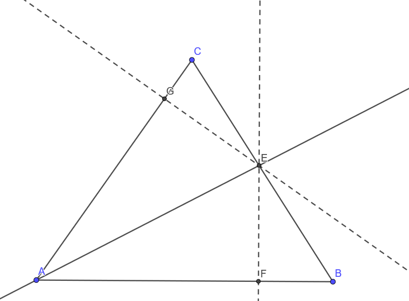

# 向量法探究三角形性质

## 概述

本文求出了三角形三线的向量表示，并用向量法证明了三角形四心相关命题

## 三角形“三线”的向量表示

### 角平分线的向量表示

在$\triangle ABC$中，$AE$是$\angle BAC$的角平分线

由角平分线性质，存在唯一$\lambda$满足$AE=\lambda(\frac{\overrightarrow{AB}}{\left|\overrightarrow{AB}\right|}+\frac{\overrightarrow{AC}}{\left|\overrightarrow{AC}\right|})=\frac\lambda{\left|\overrightarrow{AB}\right|}\overrightarrow{AB}+\frac\lambda{\left|\overrightarrow{AC}\right|}\overrightarrow{AC}$

由$C$、$E$、$B$三点共线得
$$
\frac\lambda{|\overrightarrow{AB}|}+\frac\lambda{|\overrightarrow{AC}|}=1
$$
解得
$$
\lambda=\frac{|\overrightarrow{AB}|\cdot |\overrightarrow{AC}|}{|\overrightarrow{AB}|+|\overrightarrow{AC}|}
$$
带入原式解得
$$
\overrightarrow{AE}=\frac{|\overrightarrow{AC}|}{|\overrightarrow{AB}|+|\overrightarrow{AC}|}\overrightarrow{AB}+\frac{|\overrightarrow{AB}|}{|\overrightarrow{AB}|+|\overrightarrow{AC}|}\overrightarrow{AC}
$$

### 高线的向量表示

$\triangle ABC$中，$AF$是$BC$边上的高

由$AF\perp BC$得
$$
\overrightarrow{AF}\cdot\overrightarrow{BC}=0\\
\overrightarrow{AF}\cdot\overrightarrow{AC}-\overrightarrow{AF}\cdot\overrightarrow{AB}=0\tag{1}
$$
由$B$、$F$、$C$三点共线，存在$x$满足
$$
\overrightarrow{AF}=x\overrightarrow{AB}+(1-x)\overrightarrow{AC}\tag{2}
$$
带入$(1)$解得
$$
\begin{aligned}
0&=\overrightarrow{AF}\cdot\overrightarrow{AC}-\overrightarrow{AF}\cdot\overrightarrow{AB}\\
&=x\overrightarrow{AB}\cdot\overrightarrow{AC}+(1-x)\overrightarrow{AC}^2-(1-x)\overrightarrow{AB}\cdot\overrightarrow{AC}-x\overrightarrow{AB}^2\\
&=x(-\overrightarrow{AB}^2+2\overrightarrow{AB}\cdot\overrightarrow{AC}-\overrightarrow{AC}^2)+\overrightarrow{AC} ^2-\overrightarrow{AB}\cdot\overrightarrow{AC}\\
x&=\frac{\overrightarrow{AC}^2-\overrightarrow{AB}\cdot\overrightarrow{AC}}{(\overrightarrow{AB}-\overrightarrow{AC})^2}
\end{aligned}
$$
带入$(2)$解得
$$
\overrightarrow{AF}=x\overrightarrow{AB}+(1-x)\overrightarrow{AC}=\frac{\overrightarrow{AC}^2-\overrightarrow{AB}\cdot\overrightarrow{AC}}{(\overrightarrow{AB}-\overrightarrow{AC})^2}\overrightarrow{AB}+\frac{\overrightarrow{AB}^2-\overrightarrow{AB}\cdot\overrightarrow{AC}}{(\overrightarrow{AB}-\overrightarrow{AC})^2}\overrightarrow{AC}
$$

### 中线的向量表示

在$\triangle ABC$中，$D$为$BC$的中点

由向量定比分点公式
$$
\overrightarrow{AD}=\frac 12\overrightarrow{AB}+\frac 12\overrightarrow{AC}
$$

## 三角形“四心”问题

### 重心存在性

在$\triangle ABC$中，作$AB$中点$F$，作$AC$中点$E$，作$BC$中点$D$，连$AD$、$BE$、$CF$，其中$BE$与$CF$两线交于$O$，重心存在等价于$AD$过$O$

设$\overrightarrow{CO}=x\overrightarrow{CF}$
$$
\overrightarrow{CO}=x\overrightarrow{CF}=\frac x2\overrightarrow{CA}+\frac x2\overrightarrow{CB}=x\overrightarrow{CE}+\frac x2\overrightarrow{CB}\tag{1}
$$
由$B$、$O$、$E$三点共线
$$
x+\frac x2=1\\
x=\frac23
$$
带入$(1)$得
$$
\overrightarrow{CO}=\frac x2\overrightarrow{CA}+\frac x2\overrightarrow{CB}=\frac 13\overrightarrow{CA}+\frac13\overrightarrow{CB}=\frac13\overrightarrow{CA}+\frac23\overrightarrow{CD}
$$
得$A$、$O$、$D$三点共线

### 垂心存在性

在$\triangle ABC$中，分别过$B$、$C$作$AC$、$AB$垂线，垂足分别为$D$、$E$，$BD$和$CE$交于$H$，连$AH$，垂心存在等价于$AH\perp BC$

由$\overrightarrow{BH}\perp\overrightarrow{AC}$
$$
\overrightarrow{BH}\cdot\overrightarrow{AC}=(\overrightarrow{AH}-\overrightarrow{AB})\cdot\overrightarrow{AC}=0\tag{1}
$$
由$\overrightarrow{CH}\perp\overrightarrow{AB}$
$$
\overrightarrow{CH}\cdot\overrightarrow{AB}=(\overrightarrow{AH}-\overrightarrow{AC})\cdot\overrightarrow{AB}=0\tag2
$$
$(1)-(2)$得
$$
\begin{aligned}
0&=\overrightarrow{AH}\cdot\overrightarrow{AC}-\overrightarrow{AB}\cdot\overrightarrow{AC}-\overrightarrow{AH}\cdot\overrightarrow{AB}+\overrightarrow{AC}\cdot\overrightarrow{AB}\\
&=\overrightarrow{AH}\cdot\overrightarrow{AC}-\overrightarrow{AH}\cdot\overrightarrow{AB}\\
&=\overrightarrow{AH}\cdot\overrightarrow{BC}
\end{aligned}
$$
得$\overrightarrow{AH}\perp\overrightarrow{BC}$

### 外心存在性

在$\triangle ABC$中，分别作$AB$、$AC$中垂线$FO$、$EO$，交于$O$点；作$BC$中点$D$，连$OD$，外心存在等价于$\overrightarrow{OD}\perp \overrightarrow{BC}$

连接$OA$、$OB$、$OC$
$$
|\overrightarrow{OA}|=\sqrt{\overrightarrow{OA}^2}=\sqrt{(\overrightarrow{OE}+\overrightarrow{EA})^2}=\sqrt{\overrightarrow{OE}^2+\overrightarrow{EA}^2}\tag1
$$

$$
|\overrightarrow{OC}|=\sqrt{\overrightarrow{OC}^2}=\sqrt{(\overrightarrow{OE}+\overrightarrow{EC})^2}=\sqrt{\overrightarrow{OE}^2+\overrightarrow{EC}^2}\tag2
$$

由$E$为$AC$中点，$|\overrightarrow{EA}|=|\overrightarrow{EC}|$，联立$(1)$，$(2)$
$$
|\overrightarrow{OA}|=|\overrightarrow{OC}|\tag3
$$
同理有
$$
|\overrightarrow{OA}|=|\overrightarrow{OB}|\tag4
$$
由$(3)$，$(4)$
$$
\begin{aligned}
|\overrightarrow{OB}|&=|\overrightarrow{OC}|\\
(\overrightarrow{OD}+\overrightarrow{DB})^2&=(\overrightarrow{OD}+\overrightarrow{DC})\\
\overrightarrow{OD}^2+\overrightarrow{DB}^2+2\overrightarrow{OD}\cdot\overrightarrow{DB}&=\overrightarrow{OD}^2
+\overrightarrow{DB}^2+2\overrightarrow{OD}\cdot\overrightarrow{DC}\\
\overrightarrow{OD}\cdot\overrightarrow{DB}&=\overrightarrow{OD}\cdot\overrightarrow{DC}
\end{aligned}
$$
由$D$为$BC$中点，$\overrightarrow{DB}=-\overrightarrow{DC}$
$$
\begin{aligned}
-\overrightarrow{OD}\cdot\overrightarrow{DC}&=\overrightarrow{OD}\cdot\overrightarrow{DC}\\
\overrightarrow{OD}\cdot\overrightarrow{DC}&=0
\end{aligned}
$$
得$\overrightarrow{OD}\perp\overrightarrow{BC}$

### 内心存在性

在$\triangle ABC$中，分别作$\angle ABC$、$\angle ACB$的角平分线$BE$、$CF$，两线交于$I$；连$AI$，延长交$BC$于$H$，内心存在等价于$AD$为$\angle BAC$角平分线

分别过$I$作$AB$、$BC$、$CA$垂线，垂足分别为$G$、$H$、$J$

> 引理：一条直线为一个角的角平分线当且仅当这条直线上任意一点与角的两条边距离相等

- 必要性证明：

    $BI$为$\angle ABC$当且仅当存在$\lambda$满足$\overrightarrow{BI}=\lambda(\frac{\overrightarrow{BA}}{|\overrightarrow{BA}|}+\frac{\overrightarrow{BC}}{|\overrightarrow{BC}|})$

	$$
	\begin{aligned}
&\overrightarrow{BI}=\lambda(\frac{\overrightarrow{BA}}{|\overrightarrow{BA}|}+\frac{\overrightarrow{BC}}{|\overrightarrow{BC}|})\\
\Rightarrow&\overrightarrow{BI}\cdot\frac{\overrightarrow{BA}}{|\overrightarrow{BA}|}=\lambda+\lambda\frac{\overrightarrow{BA}\cdot\overrightarrow{BC}}{|\overrightarrow{BA}|\cdot|\overrightarrow{BC}|}=\overrightarrow{BI}\cdot\frac{\overrightarrow{BC}}{|\overrightarrow{BC}|}\\
\Rightarrow&|\overrightarrow{BG}|=|\overrightarrow{BH}|\\
\Rightarrow&|\overrightarrow{IG}|=\sqrt{\overrightarrow{BI}^2-\overrightarrow{BH}^2}=|\overrightarrow{IH}|
\end{aligned}
	$$

- 充分性证明：

	$$
	|\overrightarrow{BG}|=\sqrt{\overrightarrow{BI}^2-	\overrightarrow{IG}^2}=|\overrightarrow{IH}|
	$$

	设$\overrightarrow{BI}=x\overrightarrow{BG}+y\overrightarrow{BH}$

	由$\overrightarrow{IG}\perp\overrightarrow{BG}$
	$$
	\begin{aligned}
	0&=\overrightarrow{IG}\cdot\overrightarrow{BG}\\
	&=(\overrightarrow{BG}-	\overrightarrow{BI})\cdot\overrightarrow{BG}\\
	&=(1-x)\overrightarrow{BG}^2-y\overrightarrow{BG}\cdot\overrightarrow{BH}
	\end{aligned}
	\tag1
	$$
	由$\overrightarrow{IH}\perp\overrightarrow{BH}$
	$$
	\begin{aligned}
	0&=\overrightarrow{IH}\cdot\overrightarrow{BH}\\
	&=(\overrightarrow{BH}-\overrightarrow{BI})\cdot\overrightarrow{BH}\\
	&=(1-y)\overrightarrow{BH}^2-x\overrightarrow{BG}\cdot\overrightarrow{BH}
	\end{aligned}
	\tag2
	$$
	联立$(1)$，$(2)$，解得
	$$
	x=y=\frac{\overrightarrow{BG}^2}{\overrightarrow{BG}^2+\overrightarrow{BG}\cdot\overrightarrow{BH}}
	$$

由$BI$、$CI$分别是$\ang ABC$、$\angle ACB$的角平分线
$$
|\overrightarrow{IH}|=|\overrightarrow{IG}|=|\overrightarrow{IJ}|
$$
得$AI$为$\angle BAC$的角平分线

### 内心结论

命题：$I$为$\triangle ABC$的内心当且仅当$a\overrightarrow{IA}+b\overrightarrow{IB}+c\overrightarrow{IC}=0$

分别过$I$作$AB$、$BC$、$CA$垂线，垂足分别为$G$、$H$、$J$

- 充分性证明：
    $$
    \begin{aligned}
    a\overrightarrow{IA}+b\overrightarrow{IB}+c\overrightarrow{IC}&=0\\
    -a\overrightarrow{AI}+b(\overrightarrow{AB}-\overrightarrow{AI})+c(\overrightarrow{AC}-\overrightarrow{AI})&=0\\
    b\overrightarrow{AB}+c\overrightarrow{AC}&=(a+b+c)\overrightarrow{AI}\\
    \overrightarrow{AI}&=\frac{bc}{a+b+c}\cdot\frac{\overrightarrow{AB}}{|\overrightarrow{AB}|}+\frac{bc}{a+b+c}\cdot\frac{\overrightarrow{AC}}{|\overrightarrow{AC}|}
    \end{aligned}\tag1
    $$
    得$AI$平分$\angle BAC$

    同理可得$BI$、$CI$分别平分$\angle ABC$、$\angle ACB$

    $I$为内心

- 必要性证明：

    由内心性质

    $| \overrightarrow{BG}|=|\overrightarrow{BH}|$，$|\overrightarrow{AG}|=|\overrightarrow{AJ}|$，$\overrightarrow{CJ}=\overrightarrow{CH}$
    $$
    \begin{cases}
    |\overrightarrow{BG}|+|\overrightarrow{AG}|=c\\
    |\overrightarrow{AJ}|+|\overrightarrow{CJ}|=b\\
    |\overrightarrow{CH}|+|\overrightarrow{BH}|=a
    \end{cases}
    $$
    解得
    $$
    \begin{cases}
    |\overrightarrow{BG}|=\frac{a-b+c}{2}\\
    |\overrightarrow{AJ}|=\frac{-a+b+c}{2}\\
    |\overrightarrow{CH}|=\frac{a+b-c}{2}
    \end{cases}
    $$
    由上文的结论
    $$
    \overrightarrow{AI}=\frac{\overrightarrow{AG}^2}{\overrightarrow{AG}^2+\overrightarrow{AG}\cdot\overrightarrow{AJ}}\overrightarrow{AG}+\frac{\overrightarrow{AG}^2}{\overrightarrow{AG}^2+\overrightarrow{AG}\cdot\overrightarrow{AJ}}\overrightarrow{AJ}=\frac{bc}{a+b+c}\cdot\frac{\overrightarrow{AB}}{|\overrightarrow{AB}|}+\frac{bc}{a+b+c}\cdot\frac{\overrightarrow{AC}}{|\overrightarrow{AC}|}
    $$
    由充分性证明中的$(1)$
    $$
    a\overrightarrow{IA}+b\overrightarrow{IB}+c\overrightarrow{IC}=0
    $$

### 应用

$O$为$\triangle ABC$的外心，$AB=2$，$AC=3$，$BC=\sqrt{10}$，求$\overrightarrow{AO}$用$\overrightarrow{AB}$，$\overrightarrow{AC}$表示的结果

过$O$分别作$AB$、$AC$垂线，垂足分别为$E$、$D$

$O$为$\triangle ABC$外心，$E$、$D$分别为$AB$、$AC$中点

设$\overrightarrow{AO}=x\overrightarrow{AB}+\overrightarrow{AC}$

由$\overrightarrow{OD}\perp\overrightarrow{AC}$
$$
\begin{aligned}
0&=\overrightarrow{OD}\cdot\overrightarrow{AC}\\
&=(\overrightarrow{AD}-\overrightarrow{AO})\cdot\overrightarrow{AC}\\
&=(\frac12-y)\overrightarrow{AC}^2-x\overrightarrow{AB}\cdot\overrightarrow{AC}\\
\end{aligned}\tag1
$$
由$\overrightarrow{OE}\perp\overrightarrow{AB}$
$$
\begin{aligned}
0&=\overrightarrow{OE}\cdot\overrightarrow{AB}\\
&=(\overrightarrow{AE}-\overrightarrow{AO})\cdot\overrightarrow{AB}\\
&=(\frac12-x)\overrightarrow{AB}^2-y\overrightarrow{AB}\cdot\overrightarrow{AC}\\
\end{aligned}\tag2
$$
由$(1)$，$(2)$解得
$$
\begin{cases}x=\frac13\\y=\frac49\end{cases}
$$

$$
\overrightarrow{AO}=\frac13\overrightarrow{AB}+\frac49\overrightarrow{AC}
$$

## 参考文献

[1] 数学探究——用向量法研究三角形的性质 北大附中数学荣誉课程1
